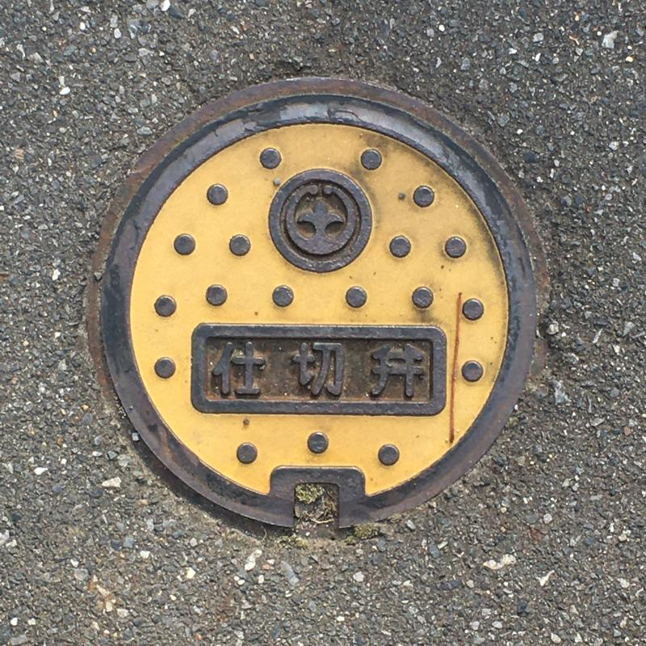

Walang tatalo sa pagbibisikleta para sa pag-explore ang lugar sa paligid ng tirahan. 5x na mas mabilis sa paglalakad, pero maaring huminto halos kahit saan para tignan ang paligid o kumuha ng picture.

Isa din ito sa mga safe na gawin sa panahon ngayon ng Covid, huwag lang kalimutan ang mask kung sakaling papasok sa mga kombini para bumili ng inumin at pagkain.

 `Kape sa second floor, hindi pa bukas.`

 `Gate valve sa daan na may logo ng Tsuchiura sa Ibaraki Prefecture.`

 `Recyclable garbage na nakaayos sa tabi ng daan.`

Sabado pala ang tapunan ng bote, can at PET bottles sa lugar na ito, at may designated na lugar kung saan ilalagay ang mga recycleble garbage, hindi lang sa ordinaryong tapunan ng mga burnable na busura. Pati mga bote ay nakahiwalay sa clear, kulay brown at kulay green. Magaling.

 `Ito naman ay basurang hindi kinuha ng garbage collector. Dahil: hindi nakalagay sa tamang plastik.`

 `6:40 ng umaga, hindi pa mainit.`

Masisikip ang daan sa lugar na ito kaya tamang-tama ang bisikleta. Maraming mga salamin para madaling makita ng mga sasakyan kung may parating na tao o sasakyan.

 `Ang pulang post box na makikita sa iba't-ibang lugar sa Japan.`

Sa panahon ngayon ng Internet at instant communication ay bumaba na ang paggamit ng mga post box pero magandang isipin na regular at efficient pa rin ang pagkolekta at pag-deliver ng sulat.

 `Bonsai sa bakuran ng isang bahay.`

Naalala ko [ito](https://www.reddit.com/r/japan/comments/64mojh/is_this_normal/):

>So nasa flight ako papuntang Tokyo sa may window seat at may bakanteng upuan sa tabi ko (dalawang row ng upuan) tapos may matandang Hapon na dumating at tinignan nya ako tapos umalis ulit. Hindi ko masyadong pinansin hanggang pumunta ako sa toilet at nakita ko na nakaupo siya sa likod ng isang matandang Hapon na babae at magkaholding hands sila kaya sabi ko, gusto nyo bang magpalit ng upuan may dalawa ako doon tapos may sinabi siyang parang samurai na hindi ko maintindihan kaya may dumating na stewardess na nag-translate at sabi nya super sorry daw yung matandang Hapon dahil pinaisip nila ako na ibigay sa kanila yung upuan ko pero sabi ko walang problema sa akin at talagang gusto kong ibigay sa kanila yung upuan kaya sabi ko na sabihin sa kanila na punta sila doon sa upuan at tuwang-tuwa sila at bow sila ng bow sa akin. Kaya nung nakaupo na sila dumating ulit yung stewardess at sabi niya binayaran daw nung mag-asawa ang full drink service para sa akin at yung matandang lalaki bibilhan daw TALAGA niya ako ng bonsai tree at gusto nyang malaman kung saan ako mag-s-stay sa Tokyo. Normal ba ito???

At may sumagot nang:

>Lagi kong binibigay ang upuan ko sa ibang tao sa tren. Ngayon andami ko ng bonsai kailangan kong magrenta ng isa pang apartment.

 `Riles ng tren: ang kaliwa ay papunta ng Fukushima at ang kanan ay Tokyo.`

 `Abubot sa ding-ding ng isang second-hand shop na nadaanan pauwi.`

 `Lumang libro sa labas: 20 yen ang isa.`

Madaming libro sa Japan (at nakasulat sa Nihongo, hindi English) at marami ding library at community center na may mga libro kaya mataas ang literacy rate sa bansa.

 `Ito ang binili kong libro.`

Mahilig akong [bumili ng libro na hindi ko naman binabasa](https://timog.org/wiki/tsundoku/). Mahilig din akong bumili ng Nihongo version ng isang libro para puwede kong pagkumparahin ang English at Nihongo version.