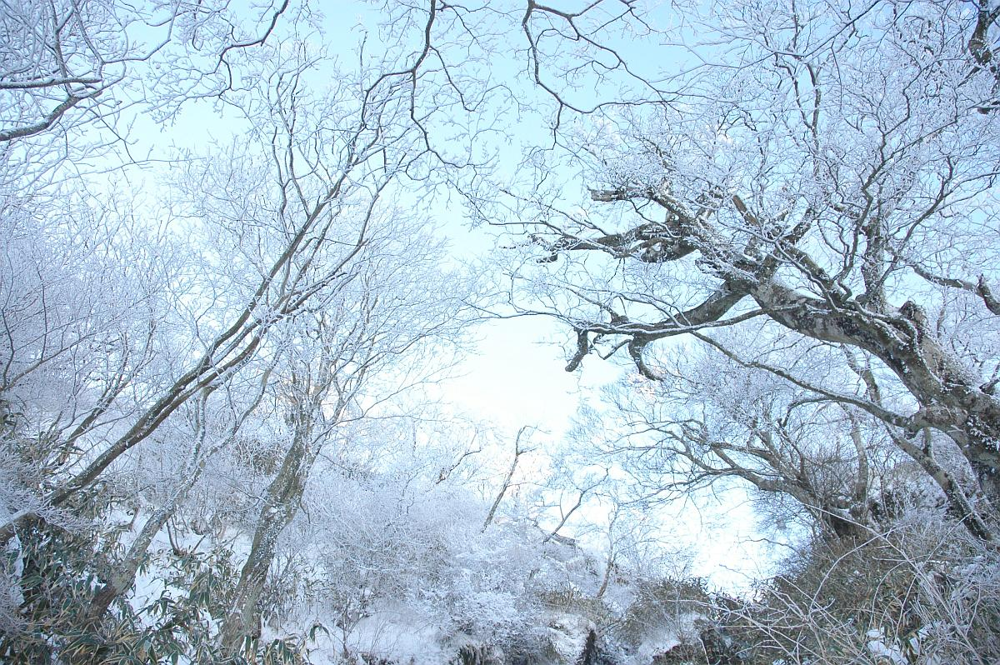
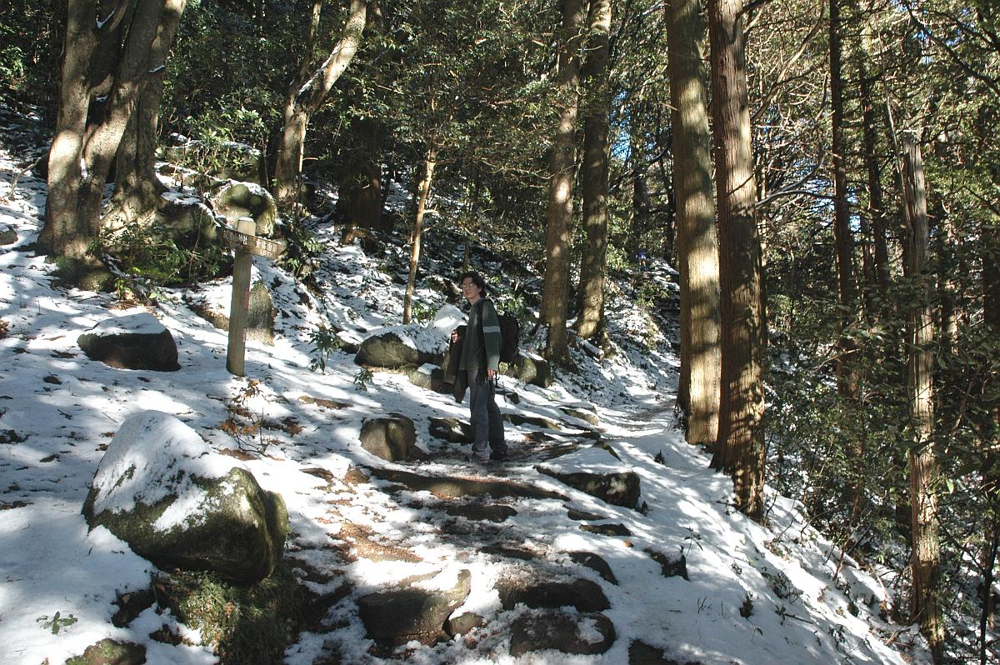
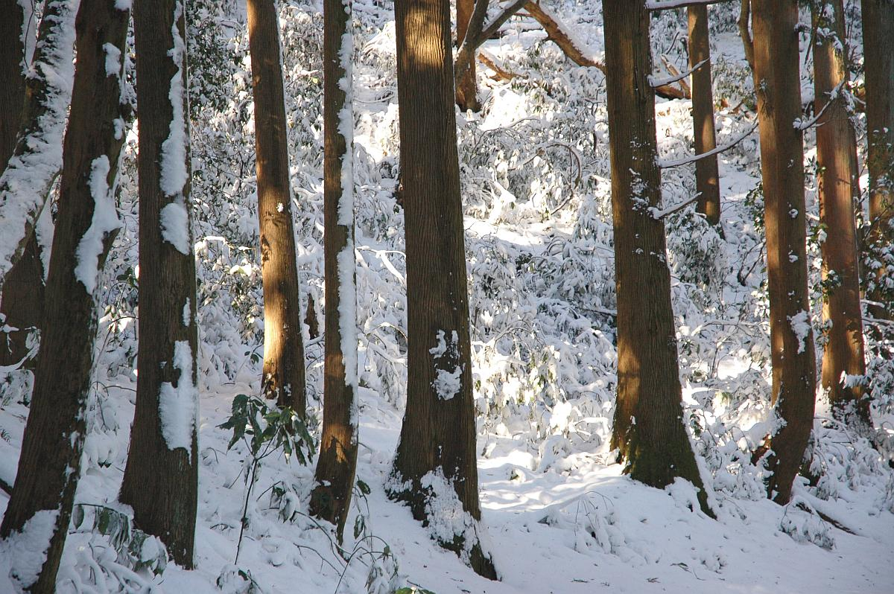
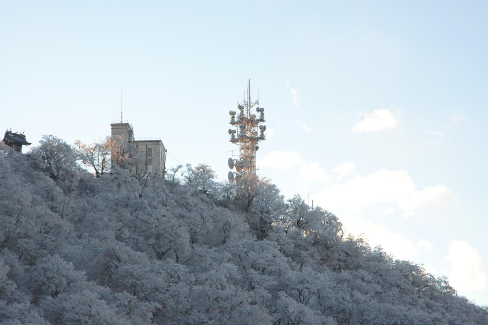
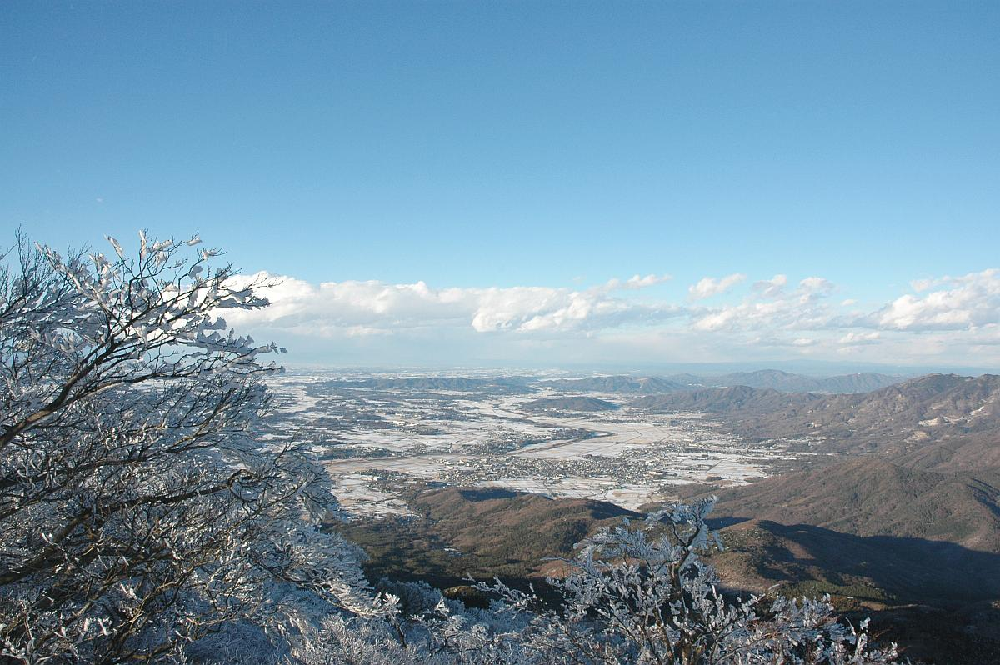
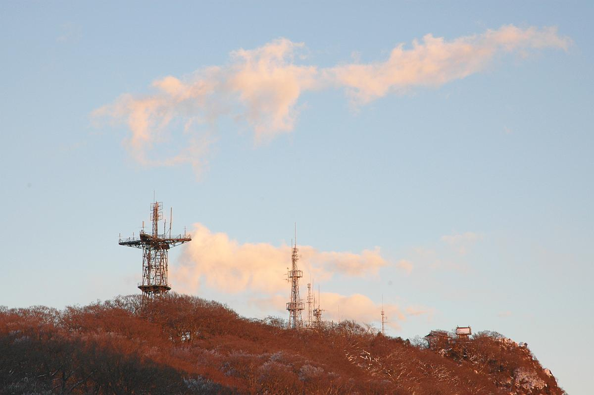
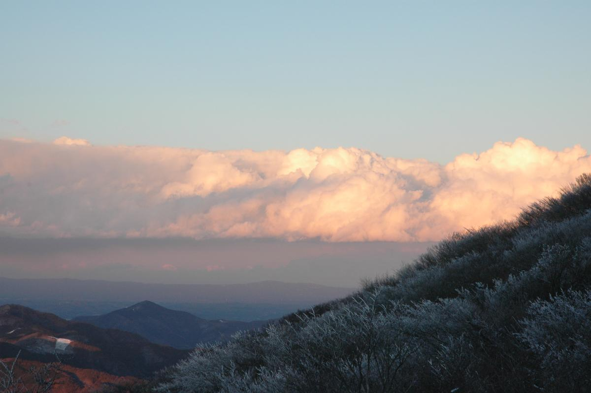

877-meter Mount Tsukuba (筑波山) in Tsukuba City, Ibaraki Prefecture is one of the most well-known mountains of Japan, the highest protrusion of land in an otherwise flat Kantō Plain. Despite its modest height, mountaineer and author Kyūya Fukada included it in his [100 Famous Mountains of Japan](https://en.wikipedia.org/wiki/100_Famous_Japanese_Mountains).

Hiking Mount Tsukuba is a regular activity for us residents of Tsukuba City year after year after year. Sometimes when we want something different, we climb its nearby cousins like Mount Kaba (加波山) or [Mount Hōkyō](../leisurely-hike-to-mount-hokyosan/) (宝篋山). But it's always Mount Tsukuba that we come back to.

I've climbed Mount Tsukuba countless times, but one of the most memorable was when my friend Ali came to visit from Tokyo one winter. A blanket of snow has just covered the mountain the previous day and although it was past noon, we decided to go for it.

.")

On our way down, with the sun fast setting, we met another couple on their way up from the cable car station. They seemed ill-prepared for the climb--they were wearing light clothing and the woman was on high-heels.

I always feel uneasy meeting people who seem not to take mountains seriously. I've climbed enough mountains to regard them with the respect they deserve and to know that climbing unprepared might easily end up in disaster, especially when climbing in cold weather.

