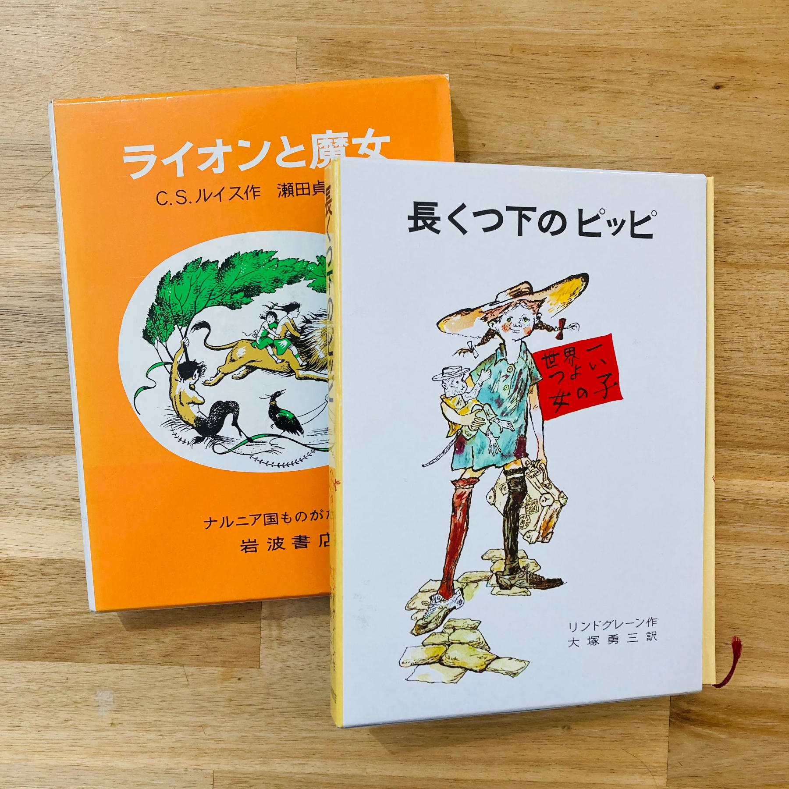
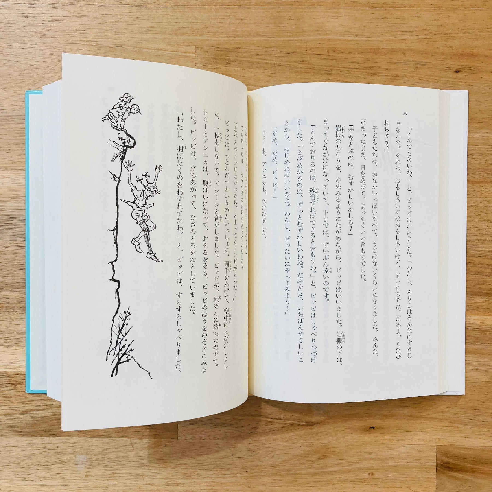
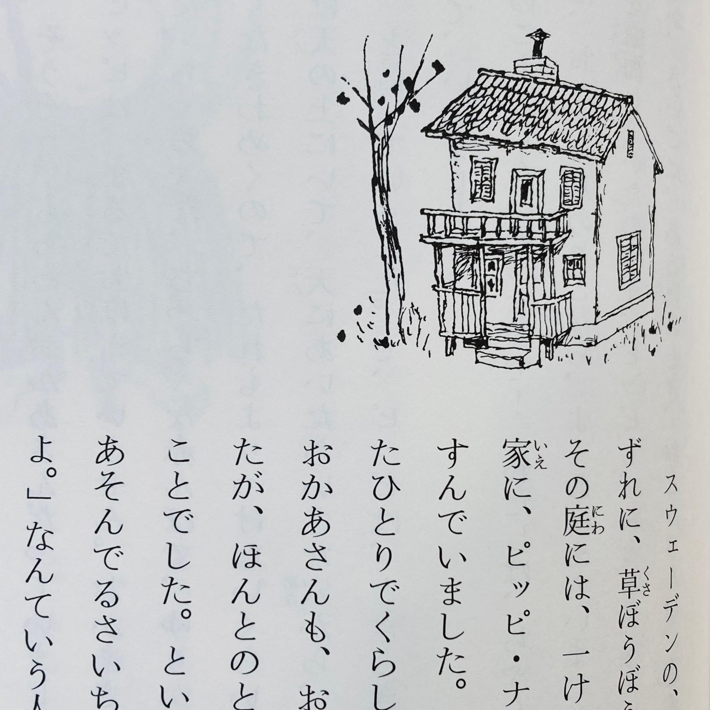
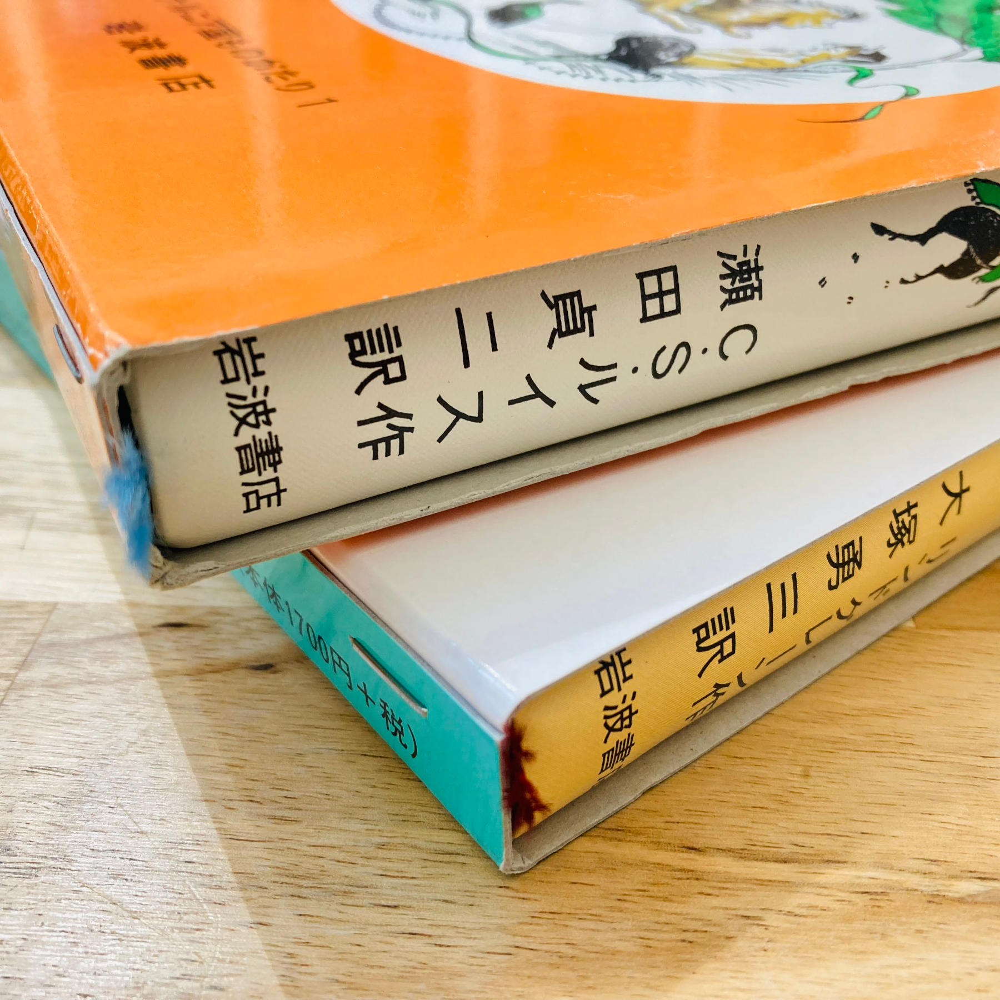

Mahilig ako sa libro.

Mahilig akong magbasa ng libro, at mahilig akong bumili ng libro--kahit mga libro na hindi ko naman binabasa. Kaya siguro hindi ako masyadong excited sa mga electronic e-readers: gusto ko yung nahahawakang pisikal na libro, yung nasasalat at naaamoy ang mga papel.

Siyempre, ang ilang lugar na gusto kong puntahan ay library at bookstore--lalo na ang secondhand bookstore kung saan maaring makabili ng murang libro.

Sa Japan maraming library at bookstore, pero kaunti lang ang Ingles na libro sa mga library at maliit lang ang English section sa mga bookstore at karamihan ay mga Nihongo (hindi kagaya sa Pilipinas na mas marami ang mga Ingles na libro kaysa sa Pilipino).

Kanina ay napunta ulit ako sa Book-Off pero walang magandang libro sa English section, kaya pumunta ako sa bargain books na Nihongo at nakabili ako nitong 長くつ下のピッピ (Nagakutsushita no Pippi) at ライオンと魔女 (Raion to Majo) na tig-220 yen bawat isa.

Itong *Nagakutsushita no Pippi* ay "Pippi Longstocking" ang tawag sa Ingles, originally Swedish na libro (Pippi Långstrump by Astrid Lindgren) na nilathala noong 1945 at isinalin sa Nihongo at palaging nakikita sa mga library at bookstore sa Japan. Hindi ko matandaan na may nakita akong ganitong libro sa Pilipinas.

Ito namang *Raion to Majo* (literally "Lion and Witch") ay ang mas sikat na "The Lion, the Witch and the Wardrobe" ni C. S. Lewis, unang libro sa The Chronicles of Narnia series. Tinanggal ang "wardrobe" sa title ng libro sa Nihongo.

Ang dalawang librong ito ay para sa mga bata sa elementary grade kaya may *furigana* (reading) ang mga *kanji* (yung ibang Grade 1 o Grade 2 na *kanji* ay wala). Kaya kung mahilig kang magbasa ng libro at nag-aaral ka ng Nihongo, baka magandang bumili ng mga ganitong libro para pagpraktisang basahin.

Sa aking experience ay magandang basahin ang ganitong libro nang malakas ang boses para masanay sa pagbabasa ng *hiragana* at simpleng *kanji* at masanay ang dila sa pagbigkas ng Nihongo. Parang ginagawa nating malakas na pagbabasa sa Grade 1 at Grade 2 noong nasa elemetary grade tayo sa Pilipinas.

Enewey, kaya ko binili ang mga librong ito (bukod sa magandang basahin) ay dahil lang sa mahilig ako sa libro. 

Ang dalawang librong ito ay maganda ang pagkakagawa (hardbound), maganda ang *feel* sa daliri, maganda ang pagka-print ng mga letra (at tama lang ang laki).

Hindi ko maipaliwanag nang mabuti ang pakiramdam ng may hawak na magandang libro sa mga kamay. Kahit hindi mo basahin nang isa-isa ang mga pahina; tignan mo na lang muna ang cover, hipuin ang mga papel, at mamangha sa pagkakagawa nito.

